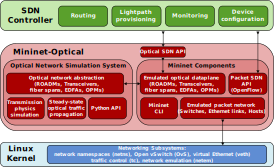

### Architecture Overview

Mininet-Optical is an optical network emulation tool that seeks to
expand on Mininet's capabilities by simulating an optical network
with elements such as Fiber Optic Cables, Terminals, Reconfigurable
Optical Add-Drop Multiplexers (ROADMs), and
Erbium-Doped Fiber Amplifiers (EDFAs).

[Mininet][1] is a packet network emulation tool that creates a realistic virtual
network, running real kernel, switch and application code,on a single
machine (VM, cloud or native). Since it is very easy to interact with
the realistic virtual network using the Mininet CLI (and API),
customize it, share it with others, or deploy it on real hardware,
Mininet is useful for development, teaching, and research. Mininet 
makes it convenient to develop, share, and experiment with
Software-Defined Networking (SDN) systems using OpenFlow and/or P4.

 <figcaption>Figure. Equivalence of a
virtual network designed in Mininet-Optical and a hardware network

The illustrated virtual network is equivalent to the real network. The
goal for Mininet-Optical is to enable the same control software to
work on a software-emulated virtual network and on a hardware
testbed. Mininet-Optical can enable us to create a "digital twin" of a
real network (or testbed) and carry out experiments in a software
environment. This enables faster turn out time and a fail-safe
approach. The emulated network can also be reset to its original
condition for repeatability or in the case of errors.

#### Architecture

Mininet-Optical creates an abstraction layer over the kernel of the
base Linux OS. The Mininet-Optical Python library has implementations
for various optical networking devices such as fiber optic cables,
terminals, ROADMs, and EDFAs. The library also has modules for Optical
signal generation and propagation. An user can modify or add further
device modules using Python.

The network devices implemented inside Mininet-Optical interact with
the SDN interface via the Python API. The SDN interface allows external
control software and algorithms to configure and manage the optical
devices.

Mininet/Mininet-Optical uses lightweight containers (processes/`cgroups`
in network namespaces) to create emulated hosts, and uses various features
of the Linux kernel such as Open vSwitch and virtual Ethernet (`veth`)
pairs to model network elements. Mininet-Optical extends packet Mininet
with emulated optical network elements, which are connected to an
optical network simulator that models the transmission physics. Northbound
control and management interfaces enable external SDN control of the
optical network elements.

The overall architecture is illustrated below:

<figcaption>Figure. Mininet-Optical Architecture

[1]: http://mininet.org

