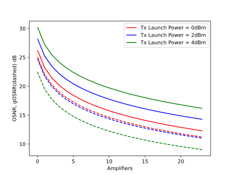
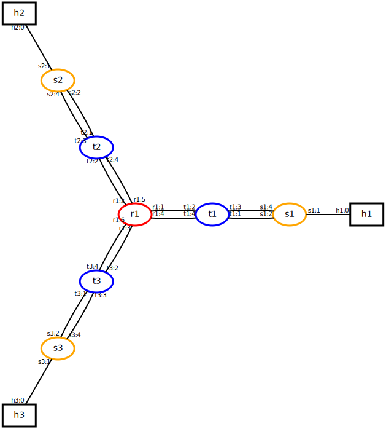

### Tutorial

Mininet-Optical can be used in either pure simulation mode, without
a packet-optical dataplane and external control plane, or in full
emulation mode, with a usable packet-optical dataplane and external
SDN control plane.

The Simulation Tutorial explains how to use Mininet-Optical in pure
simulation mode, while the Emulation Tutorial explains how to use
Mininet-Optical in full emulation mode.

#### Simulation Mode Tutorial

Mininet-Optical's simulation mode is useful when you just want to
simulate optical transmissions and don't need to send actual data
through your network, model packet devices, or use an external
SDN controller.

You may find it to be convenient due to its fast startup and
ease of use in an IDE such as Pycharm. Since it doesn't create
virtual network devices in Linux it does not require root privileges
to run.

After completing these exercises you will learn how to :

-   add nodes and links to a network model.

-   install switch rules to the ROADM nodes.

-   simulate optical transmissions.

-   model a ring topology.

*Notes:*

*For exercises 1 and 2 you will need the tests/tutorial.py script.*

*You will be generating another script labeled: three_ring_topology.py
for exercise 3.*

*Hints:*

*If you get stuck with exercises 1 and 2, please refer to
tests/monitoring_gosnr_vs_power.py for hints.*

*If you get stuck with exercise 3, please refer to tests/ringtest.py*

*Bear in mind that neither of these scripts is the answer to the
exercises!*

**Exercise 1.** Add an extra LineTerminal and a ROADM node to the linear
topology (position indistinct, i.e., could be at the beginning, middle
or end of the topology), install the appropriate switch rules that will
enable the transmission of channels 1, 2 and 3 from LT1 ---\> LT6.

**Exercise 2.** Following ex. 1), monitor the OSNR and the gOSNR levels
of channel 2 at the output interface of every EDFA in the linear
topology (TX: LT1; RX: LT6). For the transmission, use launch power
levels: 0, 2 and 4 dBm.

If motivated enough, try to plot the sequence.

**Exercise 3.** Create a ring topology with 3 ROADM nodes, transmit
channels 1, 2, 3 as follows:

channel 1 is transmitted by LT1 and is received at LT2.

channels 2 and 3 are transmitted by LT2 and are received at LT1.

Try and rearrange the transmission of channels to create loops. Is the
system catching them?

POSSIBLE OUTPUTS FROM THE EXERCISES:

**Exercise 2**.

	*** Monitoring channel with index: 2
	*** Building Linear network topology for operational power: 0
	*** Monitoring interfaces
	*** Destroying objects
	*** Building Linear network topology for operational power: 2
	*** Monitoring interfaces
	*** Destroying objects
	*** Building Linear network topology for operational power: 4
	*** Monitoring interfaces
	*** Destroying objects
	
	The OSNR of Channel 2 at every EDFA location for launch power 4.00 dBm:
	[31.502684964557986, 28.176061337796398, 26.314628272797336,
	25.015839898466922, 24.13611249709385, 23.304363233906848,
	22.60659223643803, 22.00556583390794, 21.543462282662198,
	21.06605464395392, 20.635968107119602, 20.244661874079043,
	19.931195226498627, 19.596307147424525, 19.28540409149395,
	18.99527882336643, 18.758083090421028, 18.50016560987458,
	18.25671038540936, 18.026181282510155]

	The OSNR of Channel 2 at every EDFA location for launch power 2.00 dBm:
	[33.50268137427075, 30.176059668755695, 28.31462718556177,
	27.01583909226315, 26.13611183872073, 25.304362690284655,
	24.606591773502963, 24.00556543080363, 23.543461920246425,
	23.06605431926585, 22.635967813044893, 22.244661605342294,
	21.931194976475382, 21.596306915956195, 21.285403876016776,
	20.995278621813668, 20.75808289958113, 20.500165430038248,
	20.25671021537687, 20.026181121267854]

	The OSNR of Channel 2 at every EDFA location for launch power 0.00 dBm:
	[35.502675684055035, 32.176057023505756, 30.314625462410078,
	29.01583781451658, 28.13611079526985, 27.304361828701694,
	26.60659103980043, 26.00556479192643, 25.543461345856198,
	25.06605380467, 24.635967346967934, 24.244661179423296,
	23.931194580215273, 23.596306549103637, 23.285403534508482,
	22.99527830237409, 22.758082597120293, 22.500165145016886,
	22.256709945893554, 22.026180865716036]

Plotting the values:

<figcaption>Figure. Output

#### Emulation Tutorial
	
Mininet-Optical's full emulation mode supports sending data
through the emulated network, supports modeling of packet devices
as well as optical devices, and supports external SDN control
of both packet and optical network elements.

Since emulation mode relies on Mininet (and Linux) to create
virtual network devices, it currently needs to run with root
privileges, and Python scripts are typically run using `sudo`.

For this exercise, you are going to modify the singleroadm.py script
to add additional transceivers and links, and then you are going to
configure the terminals (`t1`, `t2`, `t3`) and ROADM to enable
connectivity between all of the packet switches and hosts.

##### Part 0: Make sure `singleroadm.py` works correctly

First, make sure you can run `singleroadm.py`.

For example, you should be able to do something like this:

    $ sudo examples/simplelink.py
	
(or if that doesn't work, `sudo PYTHONPATH=. python3 examples/simplelink.py`)
	
    *** Creating network
    *** Adding controller
    *** Adding hosts:
    h1 h2 
    *** Adding switches:
    t1 t2 
    *** Adding links:
    (h1, t1) (h2, t2) (t1, t2) 
    *** Configuring hosts
    h1 h2 
    *** Starting controller
    c0 
    *** Starting 2 switches
    t1 t2 ...
    ...
    mininet-optical>

Then open up another terminal window on your VM (or machine where
mininet is running) and run the controller script, which will program
the ROADM to enable `h1` to talk to `h2` (but not `h3`!)

	$ cd ~/mininet-optical/
	$ examples/config-singleroadm.sh

You should be able to see the REST calls that config-singleroadm.sh is
making as well as `OK` results to indicate they have succeeded. You should
also see monitoring data reported by the REST monitoring calls. The
ability to monitor power and OSNR is essential to SDN control of optical
networks.

In the Mininet window, you should see a number of successful signal
receptions. The osnr command should show signals received at `t1` and
`t2` but not `t3`.

	mininet-optical> osnr
	<name: t1-monitor, component: t1, mode: in>:
	<ch1:191.35THz> OSNR: 34.70 dB gOSNR: 34.58 dB
	<name: t2-monitor, component: t2, mode: in>:
	<ch1:191.35THz> OSNR: 34.70 dB gOSNR: 34.58 dB
	<name: t3-monitor, component: t3, mode: in>:

If you run the `pingall` command, you will see that `h1` and `h2` can
talk to each other, but `h3` cannot communicate with either `h1` or
`h2`:

	mininet-optical> pingall
	*** Ping: testing ping reachability
	h1 -> h2 X
	h2 -> h1 X
	h3 -> X X
	*** Results: 66% dropped (2/6 received)

Note it is also possible to program this "y" topology so that `h1`
can talk to `h2` or `h3`, but not both at the same time!

In the next part of this exercise, you are going to modify the network
topology by adding additional transceivers and links, and then you are
going to program it to enable all of the endpoints to communicate.

For now, exit out of mininet-optical by using `exit` or control-D:

	mininet-optical> exit
	*** Stopping 1 controllers
	c0
	*** Stopping 9 links
	.........
	*** Stopping 7 switches
	r1 s1 s2 s3 t1 t2 t3
	*** Stopping 3 hosts
	h1 h2 h3
	*** Done

###### Important Note: Bidirectional Emulator API

Although the underlying *simulation* API is unidirectional, the links,
devices, and API that we will be using for this *emulation* tutorial are
**bidirectional**! This usually means that establishing a path in one
direction will establish a return path in the opposite direction, on the
same channel. With this API there is no way to select different
send/receive paths or channels. Links are bidirectional and establish a
set of fiber spans and amplifiers going in each direction. This approach
simplifies topology specification as well as SDN control, and is well
suited to this tutorial, but in our demo we will want more flexibility
to model a unidirectional hardware network (this work is currently in
progress.)

##### Part 1: Add transceivers and links

The {doc}`api-overview` explains the `simplelink.py` script and the
basics of the Mininet-Optical topology API in emulation mode.

For this part, you will need to figure out how to add an additional
transceiver to each terminal, as well as an additional link from each
terminal to the ROADM.

In order for your SDN control plane (which for this exercise will
probably be a simple configuration script similar to
examples/config-singleroadm.sh) to operate properly, you will need to
know which ports are connected on each device. You can specify the port
numbers in the parameters of the `addLink()` method.

When you are done, there should be two 50km links from `t1`<->`r1`, two
50km links from `t2`<->`r1`, and two 1m links from `t3`<->`r1`.

You can check your topology from the `mininet-optical>` prompt using the
net command. When you are done with this part, it should look something
like this:

	mininet-optical> net
	h1 h1-eth0:s1-eth1
	h2 h2-eth0:s2-eth1
	h3 h3-eth0:s3-eth1
	r1 lo: r1-wdm1:t1-wdm1 r1-wdm2:t1-wdm2 r1-wdm3:t2-wdm1 r1-wdm4:t2-wdm2
	r1-wdm5:t3-wdm1 r1-wdm6:t3-wdm2
	s1 lo: s1-eth1:h1-eth0 s1-eth2:t1-eth3 s1-eth3:t1-eth4
	s2 lo: s2-eth1:h2-eth0 s2-eth2:t2-eth3 s2-eth3:t2-eth4
	s3 lo: s3-eth1:h3-eth0 s3-eth2:t3-eth3 s3-eth3:t3-eth4
	t1 lo: t1-wdm1:r1-wdm1 t1-wdm2:r1-wdm2 t1-eth3:s1-eth2 t1-eth4:s1-eth3
	t2 lo: t2-wdm1:r1-wdm3 t2-wdm2:r1-wdm4 t2-eth3:s2-eth2 t2-eth4:s2-eth3
	t3 lo: t3-wdm1:r1-wdm5 t3-wdm2:r1-wdm6 t3-eth3:s3-eth2 t3-eth4:s3-eth3
	c0
	t1-monitor
	t2-monitor
	t3-monitor

*Don't dismiss this as incomprehensible garbage* -- it is actually
telling you useful information! Specifically, it is telling you how each
node's interfaces are connected. For example, you can see that ROADM `r1`
now has two links to each of the terminals `t1`-`t3`, for a total of 6
links. You can also see the type of the port (Ethernet or WDM) as well
as the port number. For example, `r1-wdm1` is WDM port 1 on ROADM r1.

You can also use the `spans` command, which prints out long links but
ignores links of <100m. So, you should see the links from `t1` and
`t3` but not `t2`:

	mininet-optical> spans

	(r1->t1) <boost 18.0dB> <1 25.0km> <r1-t1-amp1 5.5dB> <2
	25.0km> <r1-t1-amp2 5.5dB>
	(r1->t1) <boost 18.0dB> <5 25.0km> <r1-t1-amp1 5.5dB> <6
	25.0km> <r1-t1-amp2 5.5dB>
	(r1->t3) <boost 18.0dB> <13 25.0km> <r1-t3-amp1 5.5dB> <14
	25.0km> <r1-t3-amp2 5.5dB>
	(r1->t3) <boost 18.0dB> <17 25.0km> <r1-t3-amp1 5.5dB> <18
	25.0km> <r1-t3-amp2 5.5dB>
	(t1->r1) <3 25.0km> <t1-r1-amp1 5.5dB> <4 25.0km> <t1-r1-amp2
	5.5dB>
	(t1->r1) <7 25.0km> <t1-r1-amp1 5.5dB> <8 25.0km> <t1-r1-amp2
	5.5dB>
	(t3->r1) <15 25.0km> <t3-r1-amp1 5.5dB> <16 25.0km> <t3-r1-amp2
	5.5dB>
	(t3->r1) <19 25.0km> <t3-r1-amp1 5.5dB> <20 25.0km> <t3-r1-amp2
	5.5dB>

Note that the spans command shows the underlying physical spans (modeled
by the simulator) which are unidirectional. Note that the fiber links
don't have names but they have numbers in order to disambiguate them.

You may also wish to try the `intfs` and `ports` commands.

If you have installed `pygraphviz` (e.g. via `make depend` and/or
using `sudo apt install python3-pygraphviz`), you can use the
`plotNet()` function in `singleroadm.py` to save a plot of the topology to
`singleroadm.png`. Your revised topology should look something like
this:

<figcaption>Figure. Single ROADM Network Topology

Note that there are two links (each of which is bidirectional,
implemented as two sequences of fiber spans and amplifiers, going in
opposite directions) from each packet switch (`s1`) to its respective
Terminal (`t1`) and to the ROADM. You can also see the port numbers for
each side of each link. You may find this to be the easiest way to
understand your network at a glance and to identify port numbers for the
next part.

##### Part 2: Programming the Data Plane

Lastly, we need to program the data plane so that we have full
connectivity. In order to do this, all we need to do is enable
connectivity between two pairs of Terminals, such as (`t1`, `t2`) and
(`t2`, `t3`).

*Question to think about: Why is connecting two pairs of terminals
sufficient to connect all of the hosts?*

In fact, you do not actually want to create a *loop* among the packet
switches. Since we are using `OVSBridge` without spanning tree enabled,
creating a loop typically leads to undesirable behavior where packets
loop forever, usually rendering the network unusable or extremely slow
(the problem is exacerbated by flooding and by broadcast packets for ARP
and DHCP.) This is a common error in L2 Ethernet networks that is
frequently seen by Mininet users who (often) think it is an emulator bug
rather than realistic (but incorrectly configured) behavior!

You should be able to use the REST calls described in the tutorial,
and/or modify the existing `singleroadm.sh` script to program your
network.

When you are done, you should see a number of successful signal
connections at the terminals:

	mininet-optical> signals
	r1 Inputs:
	{1: [(<ch1:191.35THz>, 140362746465920)], 2: [(<ch2:191.40THz>,
	140362746465728)], 3: [(<ch1:191.35THz>, 140362746797456)], 4:
	[(<ch2:191.40THz>, 140362746797360)], 5: [(<ch1:191.35THz>,
	140362746797312)], 6: [(<ch2:191.40THz>, 140362746794720)]}
	r1 Outputs:
	{1: [(<ch1:191.35THz>, 140362746797456)], 2: [(<ch2:191.40THz>,
	140362746794720)], 3: [(<ch1:191.35THz>, 140362746465920)], 4:
	[], 5: [], 6: [(<ch2:191.40THz>, 140362746465728)], None:
	[(<ch1:191.35THz>, 140362746465920), (<ch2:191.40THz>,
	140362746465728), (<ch1:191.35THz>, 140362746797456),
	(<ch2:191.40THz>, 140362746794720)]}
	t1 Inputs:
	{1: [(<ch1:191.35THz>, 140362746797456), (<ch1:191.35THz>,
	140362746797456)], 2: [(<ch2:191.40THz>, 140362746794720)], -1:
	[(<ch1:191.35THz>, 140362746465920), (<ch2:191.40THz>,
	140362746465728)]}
	t1 Outputs:
	{1: [(<ch1:191.35THz>, <ch1:191.35THz>)], 2: [(<ch2:191.40THz>,
	<ch2:191.40THz>)]}
	t2 Inputs:
	{1: [(<ch1:191.35THz>, 140362746465920)], 2: [], -1:
	[(<ch1:191.35THz>, 140362746797456), (<ch2:191.40THz>,
	140362746797360)]}
	t2 Outputs:
	{1: [(<ch1:191.35THz>, <ch1:191.35THz>)], 2: [(<ch2:191.40THz>,
	<ch2:191.40THz>)]}
	t3 Inputs:
	{1: [], 2: [(<ch2:191.40THz>, 140362746465728)], -1:
	[(<ch1:191.35THz>, 140362746797312), (<ch2:191.40THz>,
	140362746794720)]}
	t3 Outputs:
	{1: [(<ch1:191.35THz>, <ch1:191.35THz>)], 2: [(<ch2:191.40THz>,
	<ch2:191.40THz>)]}

(Note: You should also see `osnr` at all of them, but for some reason that
doesn't seem to be working properly at the moment. In my tests, it only
reports osnr for `t1` and `t2`:)

	mininet-optical> osnr
	<name: t1-monitor, component: t1, mode: in>:
	<ch1:191.35THz> OSNR: 34.05 dB gOSNR: 15.99 dB
	<name: t2-monitor, component: t2, mode: in>:
	<ch1:191.35THz> OSNR: 34.11 dB gOSNR: 34.11 dB
	<name: t3-monitor, component: t3, mode: in>:

You should also be able to monitor the OSNR remotely using REST calls:

	*** Monitoring signals at endpoints
	* t1
	{"osnr": {"1": {"freq": 191350000000000.0, "osnr":
	34.04688966097812, "gosnr": 15.985167480783709, "power":
	63.095734448019336, "ase": 0.02484912117567492, "nli":
	4.00759355581639}}}* t2
	{"osnr": {"1": {"freq": 191350000000000.0, "osnr":
	34.11343356995615, "gosnr": 34.11227284182009, "power":
	0.9999493444109917, "ase": 0.00038782396576497437, "nli":
	2.653865120449501e-07}}}* t3
	{"osnr": {}}

(Hopefully we will be able to determine why there is no OSNR reported for
`t3`.)

This concludes the exercise!!

**Thanks for trying this out -- we look forward to your feedback.**

##### Hints and Advice

1.  Read the {doc}`api-overview`

    This provides an overview of Mininet-Optical's Python API as well
    as the REST control API.

2.  Pay attention to port numbers

    It's tricky (if not maddeningly so) to get this (and many SDN
    designs) working because you need to know the exact port numbers. You
    may wish to try things like:

    -   Plotting (e.g. using `plotNet()`) and printing out (or drawing)
        the topology and port numbers

    -   *Writing a helper function* to help you determine port numbers, for
        example telling you what is (or should be) connected at the other
        side of a particular node and port number, or telling you what `ROADM`
        port should correspond to what `Terminal` port for a given `Terminal`
        and transceiver, or even just dumping out what each node and port
        number is connected to.

    -   Possibly using `net.linksBetween(node1, node2)`, which returns all of
        the links (as link objects) between two nodes in the Mininet
        network. A link's endpoints are `link.intf1` and `link.intf2`.

    -   Logging port numbers/names to make sure they are what you think they
        are

3.  Testing REST calls using `curl`

    REST calls can easily be executed and tested from the shell prompt using
    `curl`, but remember to enclose the URLs in quotes to avoid the shell
    (mis)interpreting special characters like &. Note that shell variables
    (`$url`) should be enclosed in double quotes (not single quotes!) in
    order to be dereferenced.

4.  Making mistakes is OK in an emulator, but be careful with hardware

    Fortunately, if you make mistakes on a software emulator it has few
    negative consequences, but mistakes in a hardware optical network, such
    as creating an amplified laser feedback loop, could potentially have
    disastrous consequences resulting in damaged devices at the very least!
    Ideally devices will have failsafe mechanisms but this may not be
    guaranteed.

    Creating packet loops in Ethernet networks doesn't usually cause fires
    but usually results in an unusable network.

##### Extra Credit for the Insanely Motivated

This is almost certainly more than enough for now, but here are some
(extremely optional) additional projects you could think about trying if
you are excessively enthusiastic and have lots of extra time:

1.  Try passing `switch=functools.partial(OVSBridge,stp=True)` into the
    `Mininet()` constructor call (you will need to `import functools`) to
    turn on **spanning tree**. Note that it can take a while (\~30s) for
    spanning tree to do its thing (specifically discover any loops and
    block ports that create loops) but eventually you should be able to
    ping everything. Now, try creating a full mesh/loop topology where
    every terminal can connect to every other terminal. Verify that
    spanning tree enables your (bridged L2 Ethernet) network to work
    even in the presence of loops.
    
    As an alternative to spanning tree, you could also use a packet SDN
    controller such as ONOS that supports Ethernet topologies with
    loops.

2.  Create a **ring network** similar to the network from Part 1. See if
    you can replicate the same (or similar) behavior. Note that the
    emulator API that we are using for this tutorial is bidirectional,
    so ROADM rules (for example) create paths in both directions.
    Compare the OSNR and gOSNR values from simulation and emulation
    (they should match if the paths are the same!)

3.  Try using the fakecontroller.py framework to (re)write your
    **controller script in Python**.

4.  Create a **3x3 grid/mesh network** of 9 POPs (Points Of Presence,
    i.e. uplink/downlink locations) with 9 transceivers per Terminal in
    each POP. Use Manhattan routing to enable full mesh connectivity
    without creating loops and while minimizing the number of signals
    per link. Since this is an L2 Ethernet network, the connectivity
    among your packet switches (Ethernet bridges) should be a tree, or
    you should turn on spanning tree protocol for `OVSBridge` as described
    in (1) above.

5.  Take a look at `LinearRoadmTopo` and `DemoTopo` in `ofcdemo/demolib.py` as
    well as the scripts that use them, simpledemo.py and demo.py, and
    the apsp.py test controller. Unlike our simple exercises above,
    these install **IP routing rules** (programmed with OpenFlow) as
    well as multiple subnets to enable mesh connectivity. Can you create
    a mesh network with multiple subnets and a controller that
    implements a more advanced lightpath planning and routing
    algorithm?
    
    Note that `ofcdemo.demolib.configureLinearNet()` also uses OpenFlow to
    set up IP routing rules. Alternately, you could use Mininet's
    `LinuxRouter` and install rules in the routers using Linux routing
    commands.

6.  Try creating a **simplified text format** to describe a
    topology**,** and then create a `build()` method that reads your
    description format and makes the appropriate calls to create the
    topology.
    
    For example, the following format could be used to specify something
    like our simple linear network:
    
        h1 -- s1 -- t1 --25km- amp1 --25km-- t2 -- s2 -- h2
        
    and this format could be used to specify a single ROADM network:
    
        h1 -- s1 -- t1 --25km- r1 --25km-- t2 -- s2 -- h1
        r1 -- t3 -- s3 - h3
        
    You could also use another format such as dot, or anything you
    like.
    
    Some questions to think about:

    a.  How do you know the device type of a node in this specification?

    b.  How do you know whether a link is a packet link or an optical
        link?

    c.  How are the port numbers assigned?

    d.  How do we handle the other optical network device parameters?
        Can we choose reasonable defaults? If so, what should they be?
        Can we configure them in the controller? If so, how?

    e.  How do you decide how many transceivers are included in a
        terminal?

    f.  What are the advantages and disadvantages of specifying your
        topology in Python or in this simplified text format?

