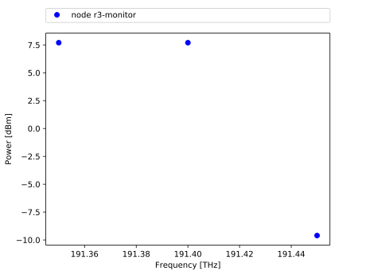
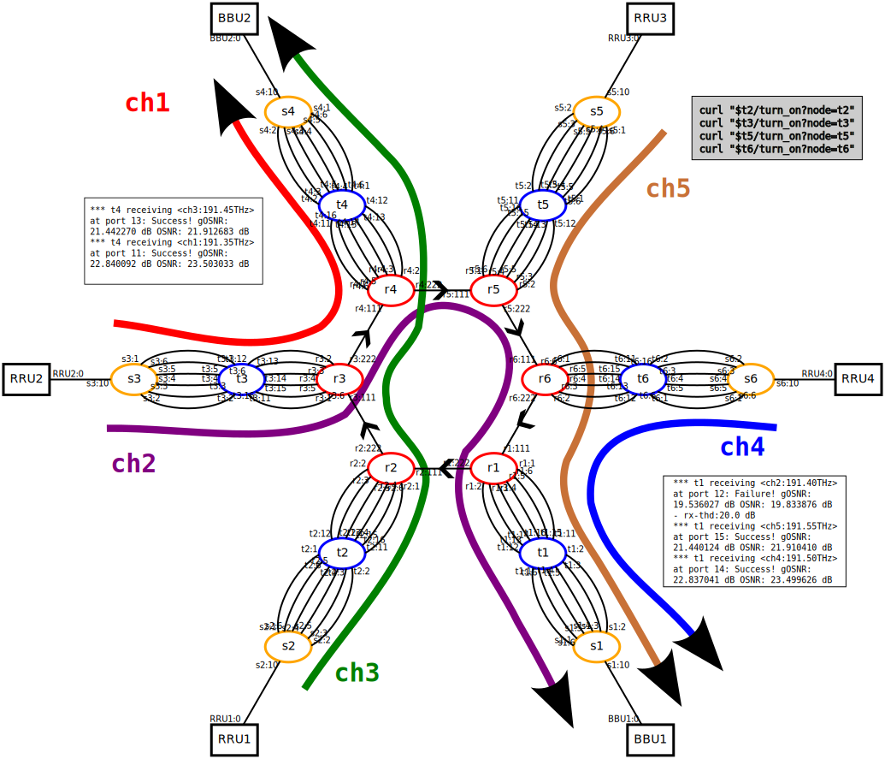

### Visualization

This walkthrough demonstrates how to use the visualization tool with
Mininet-Optical. The visualization script has been created to help you
understand how your network is behaving and/or for debugging purposes.
As for a real hardware testbed, you can monitor the power of your
signals at several points such as ROADMs, amplifiers, or transceivers,
and this walkthrough will cover the usage of the visualization.py
script. The graph obtained by the visualization tool does not aim to
represent the full spectrum but rather gives the exact power level at
each signal frequency of a given port.

#### How to run the visualization tool

*For this walkthrough we will use the **sixnodestopo.py** topology as an
example, a six ROADMs ring network, with its SDN controller
**config-6nodes.sh**.*

The visualization script retrieves information from the topology using
the REST APIs in **mininet_optical/rest.py**. Therefore, before running
the visualization python script, you need to run the emulator.

	$ sudo PYTHONPATH=. python3 examples/sixnodestopo.py

Then, in another window, run the visualization script with the --node
parameter for the node monitored:

	$ PYTHONPATH=. python3 visualization.py --node 'r3-monitor'

NOTE: the node name needs to be followed by -monitor and wrote with ' '.
To see all the available monitored nodes, on the Mininet-Optical CLI
window, run:

	mininet-optical> nodes

The graph should be empty as no signal has been launched. After running
the controller, you should see points appearing on the visualization
graph:

<figcaption>Figure. Visualization Output

By default, we monitor all the input ports of a given node and the graph
is updated every second to see "in real time" the state of the network.

It is also important to mention that the visualization script can be run
at any time, as long as the emulator is running, and by running the
script on several windows you can monitor several different ports at the
same time.

1.  Different options

Type the following command to display a help message describing the
visualization script options:

	$ PYTHONPATH=. python3 visualization.py -h

**PORT option:**

If not specified, all input or output ports are monitored and plot on a
same graph. To select a specific port, e.g., the line input port of
ROADM:

	$ PYTHONPATH=. python3 visualization.py --node 'r3-monitor' --port=111

In this case, port 111 is the line input port of r3 as shown in the
topology below, which represents the six ROADMs ring network with its
traffic:

<figcaption>Figure. Six ROADMs Ring Network with its Traffic

**MODE option:**

The --mode parameter has been created to change the monitoring mode,
i.e., if you want to monitor the input or the output ports. For example,
if you want to monitor the output line port of r3, run the following
command:

	$ PYTHONPATH=. python3 visualization.py --node 'r3-monitor'
	--port=222 --mode='out'

NOTE: By default, the input port is monitored, and the mode option
parameter also requires the use of apostrophes ' '.

#### How to access and plot other metrics

The graph currently gives you the power in dBm against the frequency in
THz, but you can choose to plot any metric available in the SDN
monitoring support function (*restMonitor* in **dataplane.py**). For
each signal; frequency, osnr, gosnr, power, ase and nli are available in
the "osnr" dictionary. Therefore, by modifying the visualization script
you can display other metrics.
